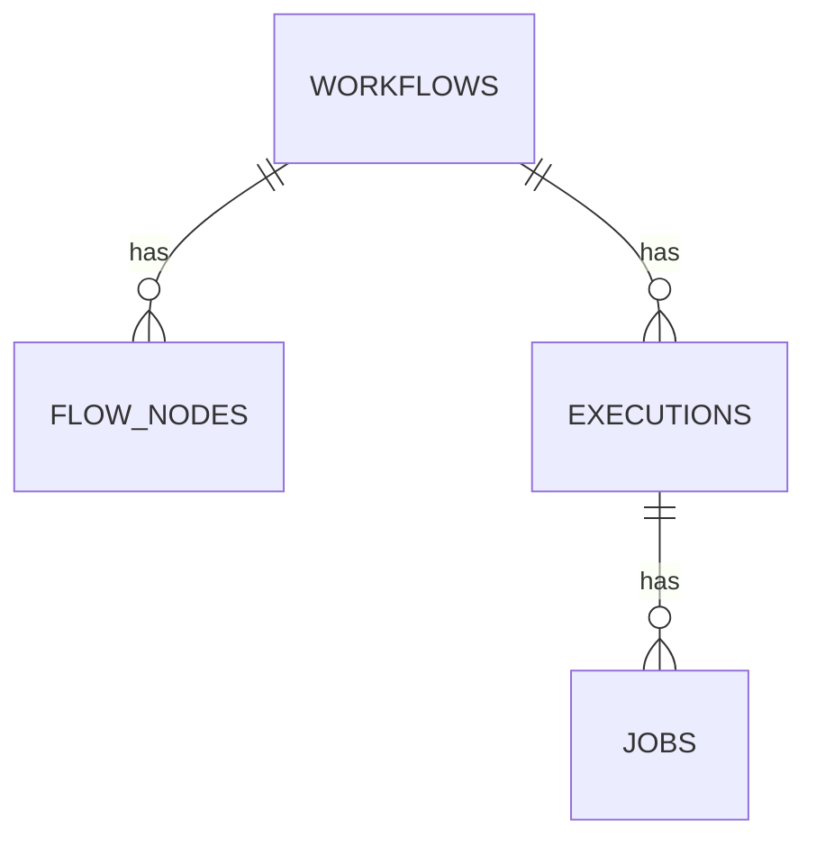

# Workflow Architecture and Core Concepts

## Architecture Overview

The NocoBase workflow engine is driven by four core tables: `workflows` (workflow definitions), `flow_nodes` (node chains), `executions` (execution records), and `jobs` (node job results).

During the orchestration phase, you mainly interact with `workflows` and `flow_nodes`. `executions` and `jobs` are records automatically generated at runtime and **do not require manual creation**.

## Core Data Models

| Table | Description | Detailed Documentation |
|---|---|---|
| `workflows` | Main workflow table; `type` is the trigger type, `config` is the trigger configuration, `key` is used for version grouping, and `current` identifies the active version. | [workflows.md](workflows.md) |
| `flow_nodes` | Node table; `upstreamId`/`downstreamId` form the chain structure, `branchIndex` represents the branch sequence, and `key` is used for cross-version referencing. | [flow_nodes.md](flow_nodes.md) |
| `executions` | Execution records; `context` is the trigger context, `status` is the execution status, and `output` stores the results of output nodes. | [executions.md](executions.md) |
| `jobs` | Node execution records; `nodeId`/`nodeKey` correspond to nodes, `status` is the node execution status, and `result`/`meta` store node outputs and metadata. | [jobs.md](jobs.md) |

## Version Control

- All versions of the same workflow share the same `key`.
- Only one version under each `key` can have `current: true`, which is the currently active version.
- **Versions that have already been executed (`versionStats.executed > 0`) cannot have their trigger configurations or nodes modified.** A new version (revision) must be created.
- Enabling a workflow (`enabled: true`) automatically sets it to `current: true` and sets the `current` status of old versions to `false`.
- The `sync` field cannot be modified after creation and must be determined during `workflows:create`.
- If need to create a new version, check [workflows:revision](../http-api/workflows.md#workflows:revision) API for details.

## Variable Reference Syntax

Logic relationships are organized through variable references in node configurations.

| Source | Syntax | Description |
|---|---|---|
| Trigger Context | `{{$context.<variableName>}}` | Data generated by trigger events, e.g., `$context.data.id`, `$context.user.id`. |
| Node Result | `{{$jobsMapByNodeKey.<nodeKey>.<variableName>}}` | Output values of a specific node; only variables from upstream nodes can be used. |
| Scoped Variables | `{{$scopes.<nodeKey>.<variableName>}}` | Only available inside specific node types (e.g., loop). |

If a variable points to a data table structure, the internal property paths match the table field names.

## Sync and Async Modes

The `sync` field of a workflow determines the execution mode and **cannot be changed after creation**:

| Mode | `sync` | Description |
|---|---|---|
| Async | `false` | Enters a queue after triggering, executes in the background, and does not block the request. Suitable for most scenarios. |
| Sync | `true` | Executes immediately within the current request after triggering, and results can be returned directly to the caller. Suitable for scenarios requiring instant feedback (e.g., Webhooks, pre-operation interception). |

Some trigger types have fixed execution modes (e.g., `schedule` can only be async); refer to the specific trigger documentation for details.

In most cases, async mode is recommended for better performance and user experience. Use sync mode only when necessary for immediate feedback in the same action.

## Status Codes

### Execution (execution) Status

| Value | Status | Description |
|---|---|---|
| `null` | QUEUEING | Waiting for processing. |
| `0` | STARTED | Executing. |
| `1` | RESOLVED | Successfully completed. |
| `-1` | FAILED | Failed (expected failure, e.g., set by an end node). |
| `-2` | ERROR | Exceptional error. |
| `-3` | ABORTED | Aborted (usually initiated from the operations side). |
| `-4` | CANCELED | Canceled (usually initiated from the business side). |
| `-5` | REJECTED | Rejected (e.g., approval rejected). |
| `-6` | RETRY_NEEDED | Retry needed. |

### Node Job (job) Status

| Value | Status |
|---|---|
| `0` | PENDING (Waiting, e.g., for manual nodes) |
| `1` | RESOLVED |
| `-1` | FAILED |
| `-2` | ERROR |
| `-3` | ABORTED |
| `-4` | CANCELED |
| `-5` | REJECTED |
| `-6` | RETRY_NEEDED |
